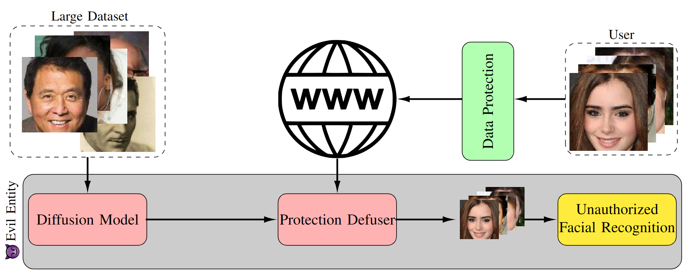

# AVATAR: Shattering the Illusion of Unexploitable Data using Diffusion Models

*Hadi M. Dolatabadi, Sarah Erfani, and Christopher Leckie 2024*

[](https://arxiv.org/abs/2303.08500)
[](https://opensource.org/licenses/MIT)

This repository contains the official implementation of the IEEE SatML 2024 paper "[_The Devil's Advocate: Shattering the Illusion of Unexploitable Data using Diffusion Models_](https://arxiv.org/abs/2112.00378)." The code is built upon the official repository of [DiffPure](https://github.com/NVlabs/DiffPure).

<p align="center">
  
</p>

Abstract: *Protecting personal data against exploitation of machine learning models is crucial. Recently, availability attacks have shown great promise to provide an extra layer of protection against the unauthorized use of data to train neural networks. These methods aim to add imperceptible noise to clean data so that the neural networks cannot extract meaningful patterns from the protected data, claiming that they can make personal data "unexploitable." This paper provides a strong countermeasure against such approaches, showing that unexploitable data might only be an illusion. In particular, we leverage the power of diffusion models and show that a carefully designed denoising process can counteract the effectiveness of the data-protecting perturbations. We rigorously analyze our algorithm, and theoretically prove that the amount of required denoising is directly related to the magnitude of the data-protecting perturbations. Our approach, called AVATAR, delivers state-of-the-art performance against a suite of recent availability attacks in various scenarios, outperforming adversarial training even under distribution mismatch between the diffusion model and the protected data. Our findings call for more research into making personal data unexploitable, showing that this goal is far from over.*

## Requirements

The code has been tested with PyTorch 1.7.1 and CUDA 11.7.
To install the entire requirements, run the following:

```setup
pip install -r requirements.txt
```

## Repository Structure

| Path | Description
| :--- | :----------
| master | The main folder containing the repository.
| &ensp;&ensp;&boxvr;&nbsp; [configs](https://github.com/hmdolatabadi/AVATAR/tree/main/configs) | Config files containing the settings of the diffusion models.
| &ensp;&ensp;&boxvr;&nbsp; [data](https://github.com/hmdolatabadi/AVATAR/tree/main/data) | Dataset information.
| &ensp;&ensp;&boxvr;&nbsp; [ddpm](https://github.com/hmdolatabadi/AVATAR/tree/main/ddpm) | DDPM library.
| &ensp;&ensp;&boxvr;&nbsp; [fast_autoaugment](https://github.com/hmdolatabadi/AVATAR/tree/main/fast_autoaugment) | Fast Autoaugment modules.
| &ensp;&ensp;&boxvr;&nbsp; [misc](https://github.com/hmdolatabadi/AVATAR/tree/main/misc) | Miscellaneous files.
| &ensp;&ensp;&boxvr;&nbsp; [models](https://github.com/hmdolatabadi/AVATAR/tree/main/models) | Classifier models.
| &ensp;&ensp;&boxvr;&nbsp; [runners](https://github.com/hmdolatabadi/AVATAR/tree/main/runners) | Runners library for denoising the datasets.
| &ensp;&ensp;&boxvr;&nbsp; [pretrained](https://github.com/hmdolatabadi/AVATAR/tree/main/pretrained) | Root folder to locate the pretrained diffusion models.
| &ensp;&ensp;&boxvr;&nbsp; [score_sde](https://github.com/hmdolatabadi/AVATAR/tree/main/score_sde) | Score SDE library.
| &ensp;&ensp;&boxvr;&nbsp; AVATAR_evaluation.py | Runner module for training classifiers on benign/unlearnable datasets.
| &ensp;&ensp;&boxvr;&nbsp; AVATAR_sanitization.py | Runner module for denoising the unlearnable datasets.
| &ensp;&ensp;&boxvr;&nbsp; data2lmdb.ipynb | Jupyter Notebook for storing large-scale data with .lmdb format.
| &ensp;&ensp;&boxvr;&nbsp; ISS_augs.py | Augmentation modules from the Image Shortcut Squeezing paper.
| &ensp;&ensp;&boxur;&nbsp; utils.py | Utility modules.

## Running the Experiments

The overall structure of the code has been given above. In particular, we mostly work with the two files `AVATAR_sanitization.py` and `AVATAR_evaluation.py`. These two steps are equivalent to the two steps taken in AVATAR. The first step sanitizes the dataset. In the second step, we train a model on these datasets using different architectures, datasets, augmentations, etc. As the primary data structure, we use `.npz` for CIFAR-10, CIFAR-100, and SVHN. For ImageNet-100, we use `.lmdb` for which we have provided a sample script of converting raw data to this format. Finally, for WebFace we use the usual `ImageFolder` structure of PyTorch.

We will explain the two primary steps below.


### Step 1: Data Sanitization

In this step, we use various diffusion models to sanitize the (possibly) corrupted data. To this end, first you need to either download the pre-trained diffusion models or train one of your own. For the experiments of this paper, we use the pre-trained models provided with the [DiffPure](https://github.com/NVlabs/DiffPure) and [DDPM-IP](https://github.com/forever208/DDPM-IP) libraries as well as our in-house models. Locate these files in their respective subfolder within the `pretrained` folder. In particular, put the CIFAR-10, CIFAR-100, SVHN, ImageNet-10, and CelebA-HQ into the `score_sde` folder and the ImageNet and ImageNet-32x32 into the `guided_diffusion` subfolder. Below, we provide the link for downloading the pre-trained diffusion models used in our experiments.

| Model | FID | Download Link | Original Source
| :--- | :----------: | :----------: | :----------:
| CIFAR-10| 2.41| [Download Link](https://drive.google.com/file/d/16_-Ahc6ImZV5ClUc0vM5Iivf8OJ1VSif/view?usp=sharing) |[ScoreSDE](https://github.com/yang-song/score_sde_pytorch) library.
| CIFAR-100| 4.85| [Download Link](https://drive.google.com/file/d/1YHV2frH1PVyUBMSgDBHP1RB1gzC191mt/view?usp=sharing) |Trained in-house using [ScoreSDE](https://github.com/yang-song/score_sde_pytorch) library.
| SVHN| 2.59| [Download Link](https://drive.google.com/file/d/1q5Ayw1i3JuCeaxVICch47V8b8P5cvfHL/view?usp=sharing) |Trained in-house using [ScoreSDE](https://github.com/yang-song/score_sde_pytorch) library.
| CelebA-HQ| -| [Download Link](https://image-editing-test-12345.s3-us-west-2.amazonaws.com/checkpoints/celeba_hq.ckpt) |[SDEdit](https://github.com/ermongroup/SDEdit) library.
| ImageNet-10| 17.32| [Download Link](https://drive.google.com/file/d/1hkv1R1h2FCALug-dhGlOOLyvWI93AFRh/view?usp=sharing) |Trained in-house using [ScoreSDE](https://github.com/yang-song/score_sde_pytorch) library.
| ImageNet-1k| 4.59| [Download Link](https://openaipublic.blob.core.windows.net/diffusion/jul-2021/256x256_diffusion_uncond.pt) |[GuidedDiffusion](https://github.com/openai/guided-diffusion) library.
| ImageNet-32x32| 2.87| [Download Link](https://drive.google.com/file/d/1FFUJDk-__9y9DnAG6DKDx5W7LgEIuJyk/view?usp=share_link) |[DDPM-IP](https://github.com/forever208/DDPM-IP) library.

**Note 1**: if any of the above download links for external models are not working, please visit their respective source GitHub.

**Note 2**: if you want to run new experiments with your own diffusion model, you should add its library to this repo and create a runner in the `runners` folder. In case your new model follows previous architectures such as `GuidedDiffusion` or `ScoreSDE`, you can just add a suitable loader to their runner files.

Once the diffusion model is ready, we can defuse availability attacks. To this end, we assume that we have an attack, denoted with `UNL_ALG`, that has been stored as either a `.npz` array with keys `data` (stored as np.uint8) and `targets`, or a respective `.lmdb` file. Then, we can run the following: 

```sanitization
python AVATAR_sanitization.py \
        --domain <UNL_DOMAIN> \
        --unlearnable_alg <UNL_ALG> \
        --path <UNL_PATH> \
        --config <CONFIG_FILE> \
        --diffusion_type <DIFFUSION_TYPE> \
        --score_type <SCORE_TYPE> \
        --t <DENOISING_STEPS> \
        --save_path <SAVE_PATH>
```
where the parameters' definition is given below:
| Command | Method Description
| :--- | :----------:
| ```--domain``` | Availability attack domain (from `[cifar10, cifar100, svhn, imagenet, webface]`).
| ```--unlearnable_alg``` | Availability attack name (use `CLEAN` in case you want to defuse the clean data).
| ```--path``` | Path to availability attack `.npz` or `.lmdb` file.
| ```--config``` | Diffusion model's config file (see the `configs` folder).
| ```--diffusion_type``` | Diffusion model type (from `[ddpm, sde]`).
| ```--score_type``` | Score type (from `[guided_diffusion, score_sde]`)
| ```--t``` | Number of diffusion steps (t* in the paper).
| ```--save_path``` | Path to save the sanitized data for use in step 2.

You can familiarize yourself with the data structure of different domains by looking at how the data is stored at the end of the `AVATAR_sanitization.py` step. 

We have released some of the availability attacks and their denoised versions for the CIFAR-10 dataset [here](https://drive.google.com/drive/folders/1Cy_TIFuJsvnckshW6SD6cqryEh2iDWCy?usp=sharing). The original availability attacks, say `AR`, have been named as `AR_CIFAR10_Sanitized_0.npz`. If the data has been denoised with our `cifar10` ScoreSDE model for 100 steps, we denote it by `AR_CIFAR10_Sanitized_100_cifar10.npz`. Following this convention, data that has been defused with the `imagenet-32x32` model has been named as `AR_CIFAR10_Sanitized_100_in32.npz`. 

**Note**: We will keep the data on Google Drive for one year after publication. After that, it is going to be deleted to save space.

### Step 2: Model Training

After we have created a database of the availability attack and/or their sanitized version using **Step 1**, we can train a model to see the performance. Besides the usual functionality, in this repo we also include basic and advanced data augmentation techniques for the CIFAR-10 dataset. These augmentations have been added similar to the [EMN](https://github.com/HanxunH/Unlearnable-Examples) and [ISS](https://github.com/liuzrcc/ImageShortcutSqueezing) libraries. To run the training, we can use (here we use the most important arguments):
```evaluation
python AVATAR_evaluation.py \
        --path <PATH> \
        --arch <ARCH> \
        --use_cutout \
        --use_mixup  \
        --use_cutmix \
        --use_fa \
        --grayscale \ 
        --jpeg <JPEG_Q> \
        --bdr <JPEG_BIT_DEPTH> \
        --domain <UNL_DOMAIN> \
        --unlearnable_alg <UNL_ALG>    
```
where the parameters' definition is given below:
| Command | Method Description
| :--- | :----------:
| ```--path``` | Path to availability attack `.npz` or `.lmdb` file.
| ```--arch``` | Classifier architecture (from `[ResNet18, ResNet50, WideResNet34, VGG16, DenseNet121]`).
| ```--use_cutout``` | Activate CUTOUT augmentation.
| ```--use_mixup``` | Activate MIXUP augmentation.
| ```--use_cutmix``` | Activate CUTMIX augmentation.
| ```--use_fa``` | Activate Fast Auto augmentation.
| ```--grayscale``` | Activate GrayScale augmentation.
| ```--jpeg``` | Activate JPEG augmentation with this quality.
| ```--bdr``` | Bit depth of the JPEG augmentation.
| ```--domain``` | Availability attack domain (from `[cifar10, cifar100, svhn]`).
| ```--unlearnable_alg``` | Availability attack name (use `CLEAN` in case you want to see the clean data performance).

**Note**: for `ImageNet-100` and `WebFace` experiments, we used the training settings found on the [REMN](https://github.com/fshp971/robust-unlearnable-examples) repo.

## Acknowledgement

This repository is mainly built upon [DiffPure](https://github.com/NVlabs/DiffPure) library. We have also used the repositories of [DDPM-IP](https://github.com/forever208/DDPM-IP), [ScoreSDE](https://github.com/yang-song/score_sde_pytorch), [AR](https://github.com/psandovalsegura/autoregressive-poisoning), [EMN](https://github.com/HanxunH/Unlearnable-Examples), [REMN](https://github.com/fshp971/robust-unlearnable-examples), [NTGA](https://github.com/lionelmessi6410/ntga), [SHR](https://github.com/dayu11/Availability-Attacks-Create-Shortcuts), and [ISS](https://github.com/liuzrcc/ImageShortcutSqueezing) to generate the attacks, purify them, or train classifiers for evaluation.
We thank the authors of all these repositories and have cited their respective papers.

## Citation

Now, if you have found our code or paper beneficial to your research in any shape, please consider starring the repo and citing our research paper as:
```bash
@inproceedings{dolatabadi2024avatar,
  title={The Devil's Advocate: Shattering the Illusion of Unexploitable Data using Diffusion Models},
  author={Hadi Mohaghegh Dolatabadi and Sarah Erfani and Christopher Leckie},
  booktitle = {Proceedings of the {IEEE} Conference on Secure and Trustworthy Machine Learning ({SatML})},
  year={2024}
}
```